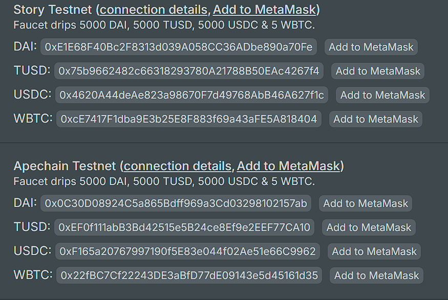

# Faucet

We've recently launched a faucet for our community members, allowing you to request funds and explore our platform on testnet. Currently, the faucet supports three networks: ApeChain, Soneium, and Story Protocol. We'll be adding more in the future.

The faucet provides tokens once every 24 hours, including WBTC, DAI, USDC, and TUSD. These tokens are enough to interact with all supported networks for the day. Since it's a multichain faucet, a single request gives you tokens across all networks at once.

Please note that the tokens are custom-built for our platform and can't be used on other dApps. For bot protection, you'll need to connect your Twitter account, but don't worry, we only request read permissions.

Important: After requesting tokens, make sure to switch to the appropriate network in MetaMask before adding token addresses. For example, if you want to add Story Protocol tokens addresses, switch to the Story testnet first. If you're on another network, like Sepolia, and try to add the token address, it'll be added to that network instead. So, be sure to select the correct network before adding the token address using the "Add to Metamask" button next to the token.

Check it out, give it a try, and keep it Zeno!\
Here’s the faucet link: [https://faucet.zeno.finance](https://faucet.zeno.finance/)

<figure><figcaption></figcaption></figure>
