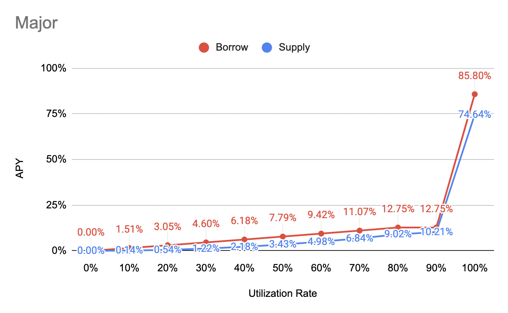
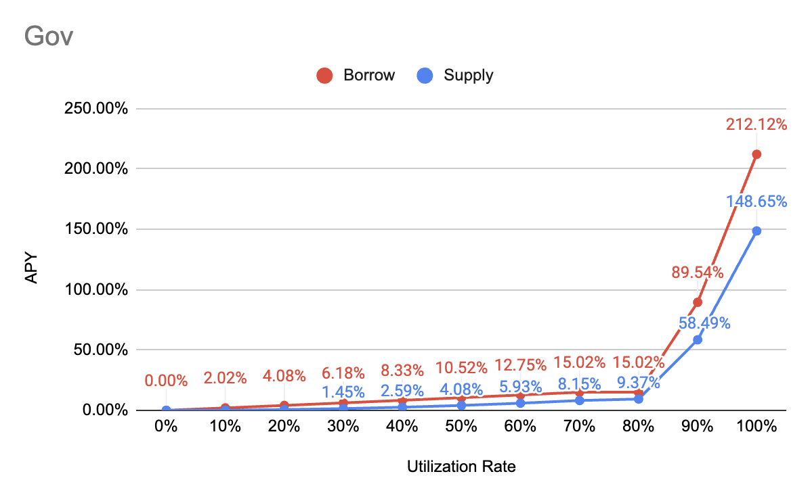

# Interest Rate Model

## APY Function 

Parameters below are different based on token type (major, stable, governance...... etc).

### **Borrow APY** 

\= {1 + \[Base + Multiplier \* min(UtilizationRate, Kink 1) + max(JumpMultiplier \* UtilizationRate - Kink 2, 0)] / BlocksPerYear } ^ BlocksPerYear - 1

### **Supply APY** 

\= Distribute (Interest Paid by Borrowers Per Block - Reserve) to all suppliers, and convert it into APY

\= Distribute \[(1 + Borrow APY) ^ (1 / BlocksPerYear) - 1] \* Total Borrow \* (1 - Reserve Factor) to all suppliers, and convert it into APY

\= {\[(1 + Borrow APY) ^ (1 / BlocksPerYear) - 1] \* Total Borrow \* (1 - Reserve Factor) / Total Supply}, and convert it into APY

\= {1 + \[(1 + Borrow APY) ^ (1 / BlocksPerYear) - 1] \* Total Borrow \* (1 - Reserve Factor) / Total Supply} ^ BlocksPerYear - 1

\= **{1+\[(1+Borrow APY)^(1/BlocksPerYear)-1]\*(1-Reserve Factor)\*Utilization Rate}^BlocksPerYear-1**

BlocksPerYear = 31,536,000 (1 sec per block)

## Major 

<figure><figcaption></figcaption></figure>

| Parameter        | Value                                      |
| ---------------- | ------------------------------------------ |
| Category         | Major                                      |
| Tokens           | WETH, WBTC                                 |
| Base             | 0%                                         |
| Multiplier       | 15%                                        |
| JumpMultiplier   | 500%                                       |
| Kink 1           | 80%                                        |
| Kink 2           | 90%                                        |
| Contract Address | 0x113FB3cADAB4a7D1Fd89607Bb6a105eD0d313167 |

## Stable 

<figure><figcaption></figcaption></figure>

| Parameter        | Value                                      |
| ---------------- | ------------------------------------------ |
| Tokens           | USDC,DAI                                   |
| Base             | 0%                                         |
| Multiplier       | 13%                                        |
| JumpMultiplier   | 800%                                       |
| Kink 1           | 80%                                        |
| Kink 2           | 90%                                        |
| Contract Address | 0x155A08107990070B08e17F21CdC7b25A57C4bbe8 |

## Tusd 

<figure><figcaption></figcaption></figure>

\

| Parameter        | Value                                      |
| ---------------- | ------------------------------------------ |
| Category         | Stable                                     |
| Tokens           | USDT                                       |
| Base             | 0%                                         |
| Multiplier       | 18%                                        |
| JumpMultiplier   | 800%                                       |
| Kink 1           | 80%                                        |
| Kink 2           | 90%                                        |
| Contract Address | 0x8CfBD27F4a990C270CF50CCd942281092b73A6bF |

## Governance 

<figure><figcaption></figcaption></figure>

| Parameters       | Value                                      |
| ---------------- | ------------------------------------------ |
| Category         | Governance                                 |
| Tokens           | Coming soon                                |
| Base             | 0%                                         |
| Multiplier       | 20%                                        |
| JumpMultiplier   | 500%                                       |
| Kink 1           | 70%                                        |
| Kink 2           | 80%                                        |
| Contract Address | 0xcE7417F1dba9E3b25E8F883f69a43aFE5A818404 |

[\
](https://docs.ib.xyz/v/optimism/lending-market/collateral-factor)
